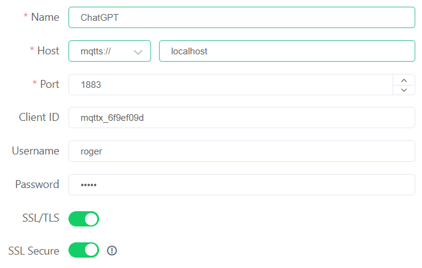
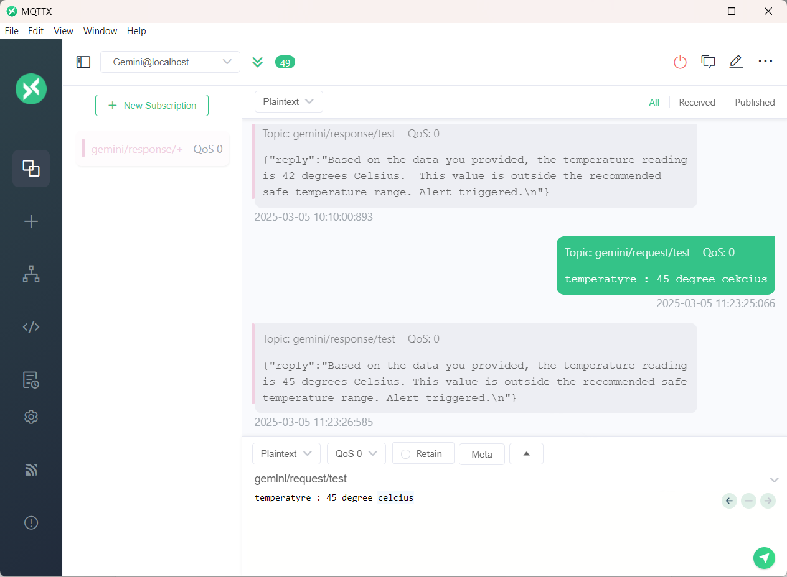

# MQTT + GPT Integration

This project demonstrates how to integrate **GPT** with the **MQTT protocol** to enable seamless natural language interaction between IoT devices and a conversational AI model.

Using the **OpenAI API**, the MQTT client receives messages from a subscribed topic, sends them to ChatGPT, and publishes the AI-generated responses back to a designated MQTT topic. This enables a continuous interaction cycle between IoT devices and ChatGPT.

---

## 🚀 Features
- Integration of **MQTT protocol** with **ChatGPT**.
- Real-time **message receiving, processing, and delivery**.
- Uses **EMQX** as the MQTT broker.
- **Docker-based setup** for quick installation.

---

## 🛠️ Prerequisites

Before running the project, ensure you have:

- **Docker** installed (for running EMQX).
- **MQTTX Desktop** client (or any MQTT client tool).
- **Gemini API key** (from [Google AI Studio](https://aistudio.google.com/)).

---

## ⚙️ Setup Instructions

### 1. Install EMQX
You can quickly launch EMQX 5.0 with Docker:

```bash
docker run -d --name emqx \ -p 1883:1883 -p 8083:8083 \ -p 8883:8883 -p 8084:8084 \ -p 18083:18083 emqx/emqx:latest
```

### 2. Install MQTTX Desktop Application
- Download from [MQTTX website](https://mqttx.app/).
- Install the version that matches your OS and CPU architecture.

### 3. Get an Gemini API Key
- Log in or create an account at [Google AI Studio](https://aistudio.google.com/).
- **Create new secret key**.
- Save the key in the `.env` file locally:


## ▶️ Running the Project

Clone this repository:

```bash
git clone https://github.com/chandu-bala/MQTT-chatGPT.git
cd MQTT-chatGPT
```

Install dependencies:

```bash
npm init -y
npm install axios mqtt dotenv
```

Run the client:

```bash
node server.js
```
<br><br>

## 🔄 Follow-up Explanation

When you run the project, the **MQTTX Desktop Client** will automatically open, create, and subscribe to the specified topic if the connection is successfully established.

If the connection is not established, you will need to **manually create a connection** in the MQTTX Desktop Client using the same **broker** and **topic details** defined in **server.js** file.


Once connected, you can **publish a message** to the subscribed topic. The Node.js client will process the message, forward it to the **OpenAI API**, and then publish the generated response back to the same topic. You will see the response instantly in the MQTTX Desktop Client.

<br><br>
## 📊 Results  

The project successfully establishes a connection with the MQTTX Desktop Client and communicates with the API.  
Messages published to the subscribed topic are processed and the responses are instantly displayed.  



<br><br>
## 📢 Notes  

For detailed documentation about this project, feel free to contact me: **chandududdela0103@gmail.com**

📄 The paper publishing details will be updated soon. 